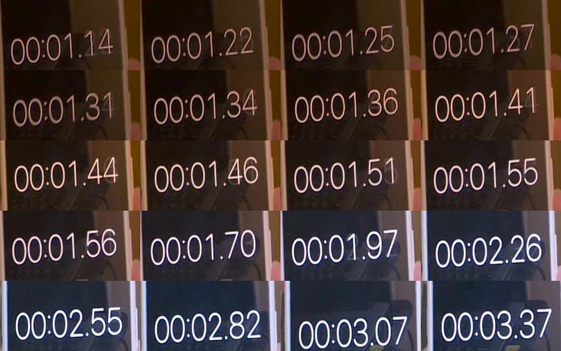
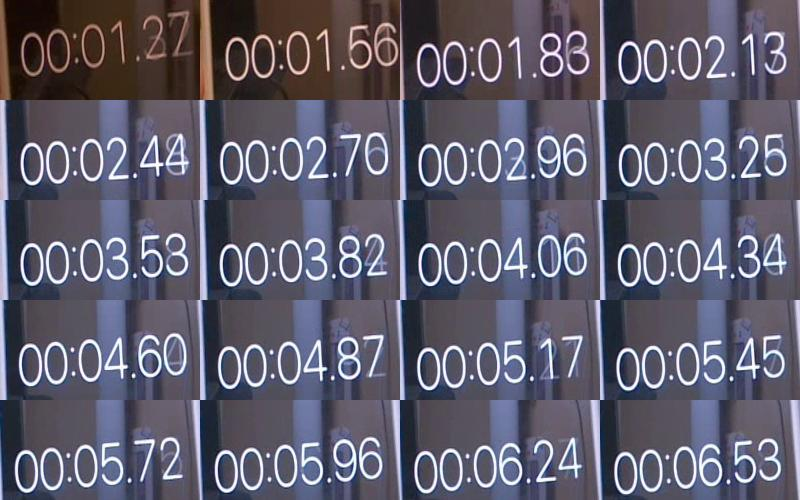

# jetson-csicam

A simple Python package which can be used to call Jetson's csi camera. Key features include:

- Pure opencv-python code, easy to modify.
- Performance optimized. Low cost on Jetson Nano!
- **Live-streaming** mode (See below “Why Live-streaming” for details)

## Why Live-streaming?

It is suitable for the cases that camera has a frame buffer, and our image processing time is long. For example, we need to get frames from camera, and then, we process it. The frame interval is 0.03s, but the image processing is slower (e.g., 0.25s). We shot to the stopwatch for a demonstration.

```python
camera = cv2.VideoCapture('<jetson id>')
while True:
    ret, frame = camera.read()

    # A time-consuming process
    time.sleep(0.25)
```

- If we use traditional method (`cap.read()`):



The camera does not perform what we want. There are two interesting facts:

1. At the beginning, the buffer is not full. The 2nd to 12th frame is reading consecutively the oldest frame in the buffer. It’s not what we want, about 0.25s to each other.
2. Later, the buffer overflows. In that case, the latest frame is appended at the end of the buffer. When we call `read()`, we are reading the front most (oldest frame) in the buffer, but not what is currently going on (latest, at the end of the buffer).

Some people may say `cap.set(cv2.CAP_PROP_BUFFERSIZE, 1)` could solve this problem. But at least for my camera, it does not support this. We need find other solutions:

- With our `jetson-csicam`:



Our code will continuously flush the unused buffer, and make the latest frame at the beginning of the buffer. In that case, every time when we call `read()`, we are always fetching the latest frame. There are no latency anymore.

## Install

```bash
git clone <https://github.com/I-am-Future/jetson-csicam>
cd jetson-csicam
pip install . # (or run `sh install.sh`)
```

## Usage

- **Construction**

Use `mycamcap.CameraCapture()` to construct a new camera object. Default parameters are `device=0, width=640, height=480, fps=30`. You can set to what you need.

- **Live-streaming mode**

Get the latest frame from camera. Recommended when processing is time-consuming, slower than the frame interval.

**Start:** Use `camera.Live_start()` to start live streaming mode.

**Read:** Use `camera.Live_read()` to read the status `success`, and `frame`. By default, it will return the original `np.ndarray` out. If you want to modify the returned frame, it is recommended to pass with `nocopy=False`.

**Stop:** Use `camera.Live_stop()` to stop live streaming mode, and release resources.

See `examples/test_live.py` for a quick example.

- **Buffer mode** (traditional method, we also support it)

Get the oldest frame from buffer. Note that buffer may be overwritten as mentioned above.

**Start/Read:** Use `camera.Buffer_read()` to read the status `success`, and `frame`. It has the same behavior as raw `cap.read()`.

**Stop:** Use `camera.Buffer_stop()` to release resources.

See `examples/test_buffer.py` for a quick example.

- **Utils:** Camera check

`camera.self_check()` is a util function that can check if the camera works well.

See `examples/test_selfcheck.py` for a quick example.

## Compatibility

The author has developed and tested this on Jetson Nano B01 4GB, with JetPack SDK 4.6. The camera is from [link](https://detail.tmall.com/item.htm?id=608399452891&spm=a1z09.8149145.0.0.5b1a5962s0ll6b). Other Jetson devices and cameras should work fine.

